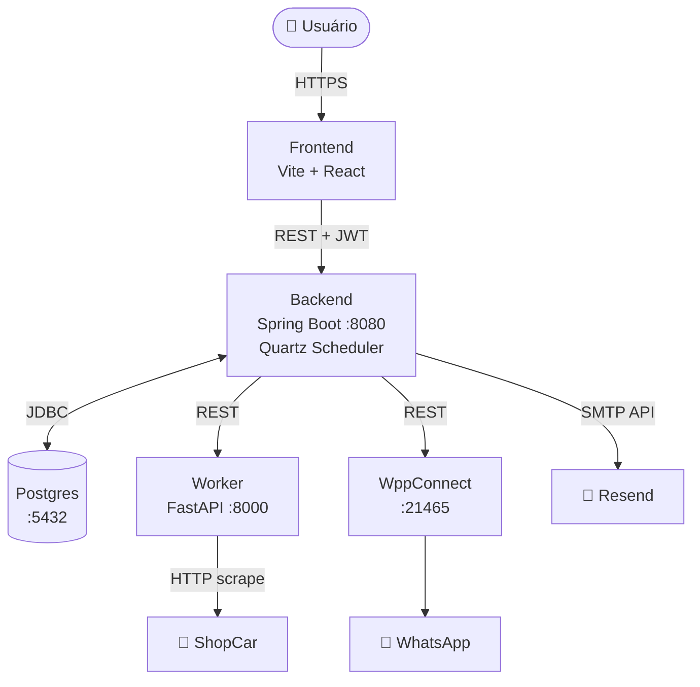
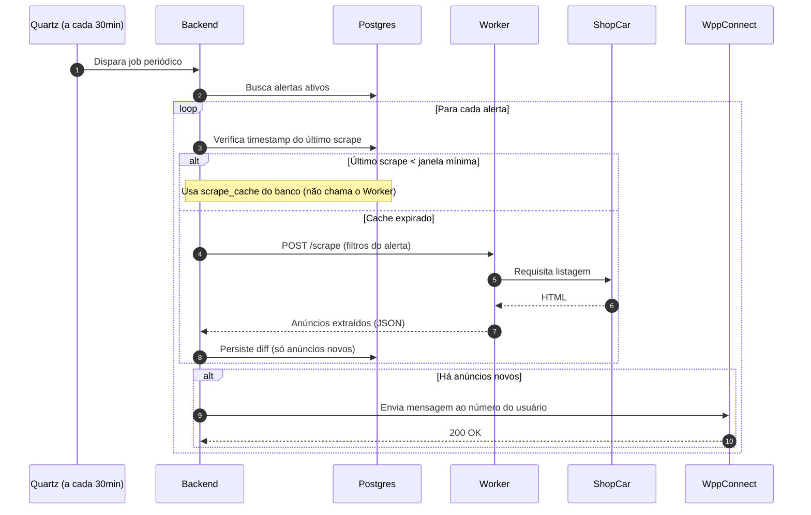

# 🚗 ScraperCar

Sistema automatizado que monitora ofertas de veículos no **ShopCar** e avisa o usuário via **WhatsApp** sempre que um anúncio novo aparece dentro dos filtros cadastrados.

> 🌐 **Online:** [scrapercar.augustdev.com.br](https://scrapercar.augustdev.com.br/) — pode criar uma conta e usar.

---

## 📑 Sumário

- [Sobre este projeto](https://claude.ai/chat/83d05ef1-369d-488a-a33b-dd087198e0c2#-sobre-este-projeto)
- [Como funciona](https://claude.ai/chat/83d05ef1-369d-488a-a33b-dd087198e0c2#-como-funciona)
- [O que aprendi construindo isto](https://claude.ai/chat/83d05ef1-369d-488a-a33b-dd087198e0c2#-o-que-aprendi-construindo-isto)
- [Stack](https://claude.ai/chat/83d05ef1-369d-488a-a33b-dd087198e0c2#-stack)
- [Rodando localmente](https://claude.ai/chat/83d05ef1-369d-488a-a33b-dd087198e0c2#-rodando-localmente)
- [Variáveis de ambiente](https://claude.ai/chat/83d05ef1-369d-488a-a33b-dd087198e0c2#-vari%C3%A1veis-de-ambiente)
- [Configurando o WppConnect](https://claude.ai/chat/83d05ef1-369d-488a-a33b-dd087198e0c2#-configurando-o-wppconnect)
- [Documentação adicional](https://claude.ai/chat/83d05ef1-369d-488a-a33b-dd087198e0c2#-documenta%C3%A7%C3%A3o-adicional)

---

## 📖 Sobre este projeto

Este é um projeto pessoal que nasceu de duas vontades ao mesmo tempo:

1. **Resolver um problema real** — ficar apertando F5 em classificado de carro é chato. Alerta por e-mail já existe em todo lugar, mas alerta no WhatsApp (onde eu de fato olho mensagem em segundos) não.
2. **Aprender na prática** a construir um sistema multi-serviço completo: orquestração, agendamento confiável, autenticação robusta, integração com APIs externas, deploy.

O resultado está online e eu uso. Além de mostrar como o sistema funciona, este README também documenta, abaixo, **o que acertei, o que falhei, e o que faria diferente** — porque esse é o tipo de coisa que eu ia querer ler se estivesse olhando o repositório de outra pessoa.

---

## ⚙️ Como funciona

### Arquitetura

Três serviços próprios (Backend, Worker, Frontend), um banco Postgres e uma instância do **WppConnect Server** (projeto externo, ver [configuração](https://claude.ai/chat/83d05ef1-369d-488a-a33b-dd087198e0c2#-configurando-o-wppconnect)).

**O Backend é o único orquestrador** — nem o Frontend nem o Worker sabem da existência dos outros. Tudo passa pelo Spring Boot. O Worker é stateless: recebe filtros, raspa o ShopCar, devolve JSON, não persiste nada.

### O fluxo do job periódico

O coração do sistema é o **Quartz**, disparando um job a cada 30 minutos, **alinhado ao relógio global** (12:00, 12:30, 13:00…) — não ao horário em que a aplicação subiu. A frequência mínima que um usuário pode escolher também é 30 minutos, então todos os ticks batem nessa mesma janela.

Três decisões importantes estão codificadas nesse fluxo:

- **Jobs compartilhados entre usuários com filtros idênticos.** Os filtros do alerta são normalizados e passam por um hash Murmur3, gerando uma `veiculoKey`. Dois usuários com os mesmos filtros caem na **mesma chave** e compartilham um único job no Quartz — não existem dois jobs fazendo o mesmo trabalho. Reduz carga no ShopCar e no Worker.
- **Cache de scrape em banco.** A tabela `scrape_cache` guarda, indexada por `veiculoKey`, o último resultado (JSONB do Postgres) e o timestamp. Se o cache ainda estiver válido (dentro do intervalo do job), o Worker nem é chamado.
- **Diff antes de notificar.** O Worker pode trazer 50 anúncios, mas só os realmente novos em relação ao último snapshot viram mensagem. E se um anúncio já notificado **mudou de preço**, o sistema envia uma notificação separada de variação (com seta e percentual).

---

## 🧠 O que aprendi construindo isto

Esta é a parte do README que normalmente não existe em projetos de portfólio. Acho que deveria existir.

### ✅ Acertos que tenho orgulho

**Agendamento com Quartz + JobStore em banco.** No começo do projeto, essa era a parte mais nebulosa pra mim — eu sabia o _comportamento_ que precisava (rodar periodicamente, frequência configurável por usuário, sobreviver a restart) mas não tinha ideia de qual ferramenta usar. Fui pesquisar agendadores no ecossistema JVM e achei o Quartz com JobStore JDBC, que entregava exatamente o que eu queria sem precisar adaptar nada. Encaixou direto.

O aprendizado aqui não foi tanto sobre scheduling em si, mas sobre **procurar a ferramenta certa em vez de inventar uma solução caseira**. Foi o momento em que a arquitetura do projeto "clicou" pra mim — a partir dali, o resto veio mais natural.

**Autenticação com Argon2ID + pepper.** Comecei sabendo quase nada sobre hash de senha além de "usa bcrypt". Fui fundo e escolhi Argon2ID conscientemente — é o vencedor do Password Hashing Competition, tem resistência melhor contra ataques de GPU e trade-off configurável de memória/CPU/paralelismo (bcrypt, embora ainda seguro, é da década de 90 e tem limite de 72 bytes). Em cima disso, adicionei **pepper**: uma string secreta que mora fora do banco e se concatena à senha antes do hash. Se o banco vazar, o atacante ainda precisa comprometer o servidor pra ter chance de cracking offline.

Dos componentes do sistema, é o que eu tenho mais confiança que está sólido.

**Pipeline scrape → diff → notificação.** Receber o JSON do Worker, comparar com o snapshot do banco, identificar só os anúncios novos e despachar pro WppConnect — esse caminho saiu limpo, com responsabilidades bem separadas entre services. Foi onde a teoria de camadas (controller → service → repository) saiu do papel pra virar intuição.

**Jobs compartilhados entre usuários (SharedSearchJob).** Talvez a decisão arquitetural que mais me orgulha. Em vez de criar um job Quartz por usuário, o sistema agrupa usuários com filtros idênticos: os filtros são normalizados, passam por um hash Murmur3 e geram uma `veiculoKey`. Dois usuários com mesmos filtros → mesmo `veiculoKey` → **mesmo job**. Um único scrape atende todo mundo. Quando alguém cria um alerta com intervalo menor que o do job existente, o trigger é reagendado pra respeitar o menor. Quando o último usuário remove seu alerta, o job é deletado do Quartz e do banco automaticamente.

É uma solução simples que resolve um problema que cresce mal: sem isso, 100 usuários com mesmo filtro gerariam 100 jobs. Com isso, gera 1.

### ⚠️ Tropeços e custos que valeram como lição

**Fluxo de cadastro e verificação de número.** A lógica que amarra o registro do usuário no banco com a verificação do número de WhatsApp ficou com decisões que, revendo hoje, eu refaria diferente. O ponto mais frágil é o **canal de comunicação de volta do WppConnect para o Spring Boot** — a forma como o Backend fica sabendo que o usuário respondeu o código de verificação. Esse caminho foi improvisado durante a implementação e hoje eu escolheria um mecanismo diferente. É a parte do código que mais denuncia "fui aprendendo enquanto escrevia".

### 🔄 O que eu faria diferente hoje

- **Começaria com Flyway desde o dia 1.** `ddl-auto=update` é conveniente em dev, mas em produção que recebe refactors, migrações versionadas evitam surpresas e permitem rollback.
- **Separaria auth em módulo próprio desde cedo.** Deixei crescer junto ao resto do código e agora refatorar tem custo.
- **Investiria em observabilidade mais cedo.** Hoje, se algo dá errado num tick do Quartz, eu dependo de ler logs soltos. Um `actuator` + Prometheus + um Grafana simples teria economizado tempo de debug.
- **Escreveria testes antes do código que eles testam.** Tenho testes, mas muitos vieram depois do código pronto — e isso se reflete na qualidade deles.

---

## 🧰 Stack

| Camada       | Tecnologia                                              |
| ------------ | ------------------------------------------------------- |
| Frontend     | Vite + React                                            |
| Backend      | Java 25 + Spring Boot 4 + Quartz + WebClient + Bucket4j |
| Worker       | Python + FastAPI                                        |
| Banco        | PostgreSQL                                              |
| Auth         | JWT (access + refresh) + Argon2ID + pepper              |
| WhatsApp     | WppConnect Server (projeto externo)                     |
| E-mail       | Resend                                                  |
| Orquestração | Docker Compose                                          |

---

## 🚀 Rodando localmente

Todo o stack sobe via **Docker Compose** a partir da raiz do repo, usando as variáveis de um `.env` (modelo em `.env.example`).

|Serviço|URL local|
|---|---|
|Frontend|http://localhost:5173|
|Backend|http://localhost:8080|
|Backend API docs|http://localhost:8080/swagger-ui/index.html|
|Worker|http://localhost:8000/docs|
|WppConnect|http://localhost:21465|
|Postgres|localhost:5433|

> ⚠️ Em banco novo, as tabelas do Quartz precisam ser inicializadas via propriedade do Spring — detalhes em [`Backend/README.md`](https://claude.ai/chat/Backend/README.md).

---

## 🔐 Variáveis de ambiente

As chaves necessárias estão documentadas em `.env.example`, com instruções de como gerar cada uma (ex: `openssl rand -base64 64` para o `JWT_SECRET`).

> 🔒 `.env` e `application-local.properties` **nunca** são commitados — ambos estão no `.gitignore`.

---

## 📱 Configurando o WppConnect

> **Crédito:** [WppConnect](https://github.com/wppconnect-team/wppconnect-server) é um projeto open-source de terceiros. Este repositório apenas consome a API dele.

O contêiner do WppConnect sobe junto com o `docker compose up`, mas requer um pareamento inicial com uma conta de WhatsApp via QR Code. A sessão fica persistida em volume Docker após o primeiro login. Veja a [documentação oficial do WppConnect](https://wppconnect.io/docs/server/api) para o fluxo de autenticação e geração de token.

---

## 📚 Documentação adicional

- [`Backend/README.md`](https://github.com/Augustbr01/ScraperCar/blob/develop/Backend/README.md) — detalhes do Spring Boot
- [`docs/architecture.md`](https://github.com/Augustbr01/ScraperCar/blob/develop/docs/architecture.md) — decisões de design e trade-offs

---

## 👤 Autor

**Augusto Corrêa** — [@Augustbr01](https://github.com/Augustbr01)

Projeto pessoal, em uso. Feedback e sugestões são bem-vindos via issues.